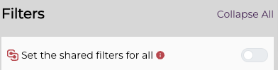
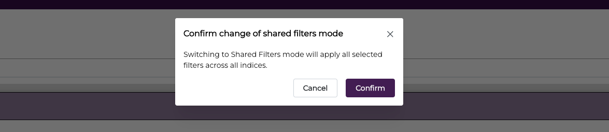
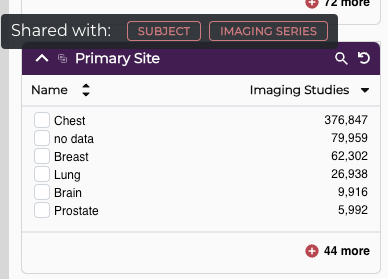
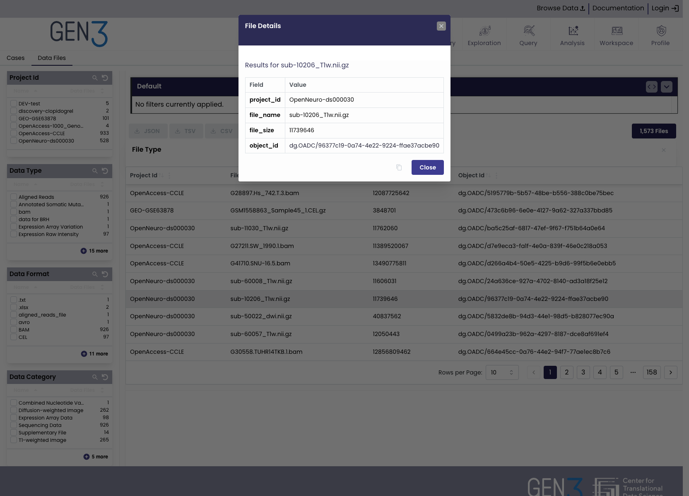
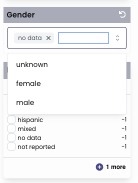

# Configuring Explorer

The Gen3 explorer component is a cohort builder that provides Summary Statistics and  Tables view of filter data. The Cohort builder can have multiple tabs representing each configure index.
For example, "Cases", "Images", "Data Files".

## Configuration


The configuration for the explorer is stored an array of objects. Each object in the array represents a tab in the explorer. The following is an example of a tab configuration:

```json
[
  {
    "enabled": true,
    "title": "Cases",
    "index": "case",
    "table": {
      "enabled": true,
      "pageLimit": {
        "limit": 10000
      },
      "columns": [
        {
          "name": "case_id",
          "label": "Case ID",
          "visible": true,
          "sortable": true
        },
        {
          "name": "project_id",
          "label": "Project ID",
          "visible": true,
          "sortable": true
        },
        {
          "name": "disease_type",
          "label": "Disease Type",
          "visible": true,
          "sortable": true
        }
      ]
    }
  }
]
```
### Multiple Configuration Support

Explorer can also support multiple configurations. To use this create
one or more configuration files in the directory ```config/COMMONS_NAME/explorer```
The name of the file is then passed to Explorer as path.
For example if there are two configuration files:
```cases.json``` and ```files.json```, the URL for these will be
```bash
https://localhost/Explorer/cases
```
and
```bash
https://localhost/Explorer/files
```

### Shared Filters
Explorer is configured to provide a horizontal tabs for
each data index (each entry in the configuration array). Each tab represents
a separate data index. Depending on the data schema. Depending on how
the data is defined, some field entries are duplicated
across on some or all of the other tabs. Typically, each filter set (the filter panels)
is independent of the other tabs. Gen3.2 has support for **sharing** filters across the tabs.

To enable this, add the following to the root of the config file:

```json
{
"sharedFilters": {
  "defined": {
    "primary_site": [
      { "index": "imaging_study", "field": "primary_site" },
      { "index": "subject", "field": "primary_site" },
      { "index": "imaging_series", "field": "primary_site" }
   ],
  "project_id": [
    { "index": "imaging_study", "field": "project_id" },
    { "index": "subject", "field": "project_id" },
    { "index": "imaging_series", "field": "project_id" }
    ]
  }
},
"explorerConfig" : [
   // rest of config file
]
}
```
or
```json
"sharedFilters": {
   "autoCreate" :  true
},
```

In the first config the shared filters are explicitly set. This allow to share filters on other tabs where the
field names are not the same across the tabs/indexes.
The second config will query the database API to build the sharing configuration automatically. This can be used when the
filter names are identical.

If sharing is enabled and there are shared filters, the filters panel will have a Shared Filters switch:



When Filter Sharing is enabled:
* all currently selected filters will be added to their shared tabs.
* all changes to a shared filter will also be updated on all shared tabs
* Editing the query expression will change all shared filters

When changing from shared to no-shared:
* all shred filters remain
* all changes to a filter on one tab will no longer changes shared filters on other tabs.


When switching modes the following dialog will appear:




To see the other tabs for a shared filters, hover over the share icon:




### Charts
The charts section configures data visualizations for the explorer page. Each chart is defined by its `chartType` and `title`.

```json
"charts": {
      "race": {
        "chartType": "fullPie",
        "title": "Race"
      },
      "ethnicity": {
        "chartType": "horizontalStacked",
        "title": "Ethnicity"
      },
      "gender": {
        "chartType": "bar",
        "title": "Gender"
      }
    }
```

The currently supported chart types are:
* `bar`: a regular vertical bar chart.
* `horizontalStacked`: horizontal stacked bar chart.
* `fullPie`: full pie chart.
* `donut`: pie chart with a hole.

### Download Table Data

Download table is a dropdown of download filetypes. There is support for `csv` `tsv` and `json` formats. Each download has an associated action and is called like:

```json
{
  "dropdowns": {
    "download-menu": {
      "enabled": true,
      "title": "Download Table",
      "leftIcon": "gen3:download",
      "rightIcon": "gen3:chevron-down",
      "dropdownItems": [
        {
          "enabled": true,
          "title": "JSON",
          "leftIcon": "datafile",
          "rightIcon": "download",
          "action": "data-json",
          "actionArgs": {
            "filename": "MIDRC_Series_table.json"
          }
        },
        {
          "enabled": true,
          "title": "CSV",
          "leftIcon": "datafile",
          "rightIcon": "download",
          "action": "data-csv",
          "actionArgs": {
            "filename": "MIDRC_Series_table.csv"
          }
        }
      ]
    }
  }
}
```

The downloads menu is a dropdown with the following members:

* `enabled`(optional default True) - enables the button
* `title` - Label of the button
* `actionTitle` (optional) - label to show when button's action is active
* `leftIcon` (optional) - draw icon on left of the label
* `rightIcon` (optional) - draw icon on right of labe
* `tooltipText` (optional) - tooltip text
* `action` - action function to use for the download
* `actionArgs` - argument for the action
  for example:
  * `filename` - base name of download is used for the actions:
    * `data-tsv`
    * `data-csv`
    * `data-json`

### Download Buttons
Individual button (horizontally laid out) can be configured as:

```json
 "buttons": [
      {
        "enabled": true,
        "type": "data-json",
        "title": "JSON",
        "dropdownId": "download-table",
        "leftIcon": "datafile",
        "rightIcon": "download",
        "actionArgs": {
          "filename": "data_table.json"
        }
      },
      ...
]
```
Note that the button object members are the same as for the dropdowns.

### Download Manifest

Download a file manifest from a explorer table requires the following configuration:json

```json
{
   "enabled": true,
   "type": "manifest",
   "action": "manifest",
   "title": "Download Manifest",
   "leftIcon": "gen3:datafile",
   "rightIcon": "gen3:download",
    "fileName": "manifest.json",
    "actionArgs": {
        "resourceIndexType": "data_file",
        "resourceIdField": "object_id",
         "referenceIdFieldInResourceIndex": "_case_id",
         "referenceIdFieldInDataIndex": "_case_id"
    }
}
```
This is similar to the configuration for Gen3's data-portal except the `actionArgs` member now contains the information that was in the `manifestMapping` member of `gitops.json`

### Details Modal

There is support for a details modal that appears when the table is clicked. The modal's content is rendered using the
default or a registered ```DetailsPanel```.



The basic configuration is:

```json
 "table": {
      "enabled": true,
      "detailsConfig": {
        "panel": "fileDetails",
        "mode": "click",
        "idField": "file_name",
        "title": "File Details",
        "classNames": {
          "header" : "!bg-secondary"
        }
      }

```

The details configuration has the following members:

* mode - mode that activates the modal/drawer. Currently only click is supported
* panel - name of the registered panel, defaults to "default"
* params - object of addition (e.g. custom) parameters/values passed to the Details panel
* classNames: object containing tailwind styling for the modal/drawer component. See [Mantine V6 Modals stules](https://v6.mantine.dev/core/modal/?t=styles-api)
  NOTE: the tailwind directive need to be important so the must be prefixed with ```!```
* title - title of the modal/drawer
* withCloseButton - should modal have a close (i.e. x ) button
* closeOnEscape - if true, closed when the esc key is pressed
* closeOnClickOutside - close when anywhere outside the modal is closed
* size - size of the modal

## Selection Facet

A new facet UI is available instead of the enumerated facet, which can be used when the number of facet keys becomes
quite large. To enable it, in the filters->tabs section of the config file:

```json
    {
     "filters": {
      "tabs": [
        {
          "title": "Study Selection",
          "fields": ["project"]
        },
        {
          "title": "Subjects",
          "fields": [
            "study",
            "gender",
            "race",
            "ethnicity",
            "vital_status",
            "whatever_lab_result_value"
          ],
          "fieldsConfig": {
            "gender" : {
              "type" : "multiselect"
            }
          }
        }
      ]
    },

```

add a ```fieldsConfig``` entry. The format is _field_ name then _type_. In the example above the```gender``` field is
switch to use ```multiselect```. Note that ```multiselect``` is the only type supported. The selection is a dropdown that
is also searchable.


