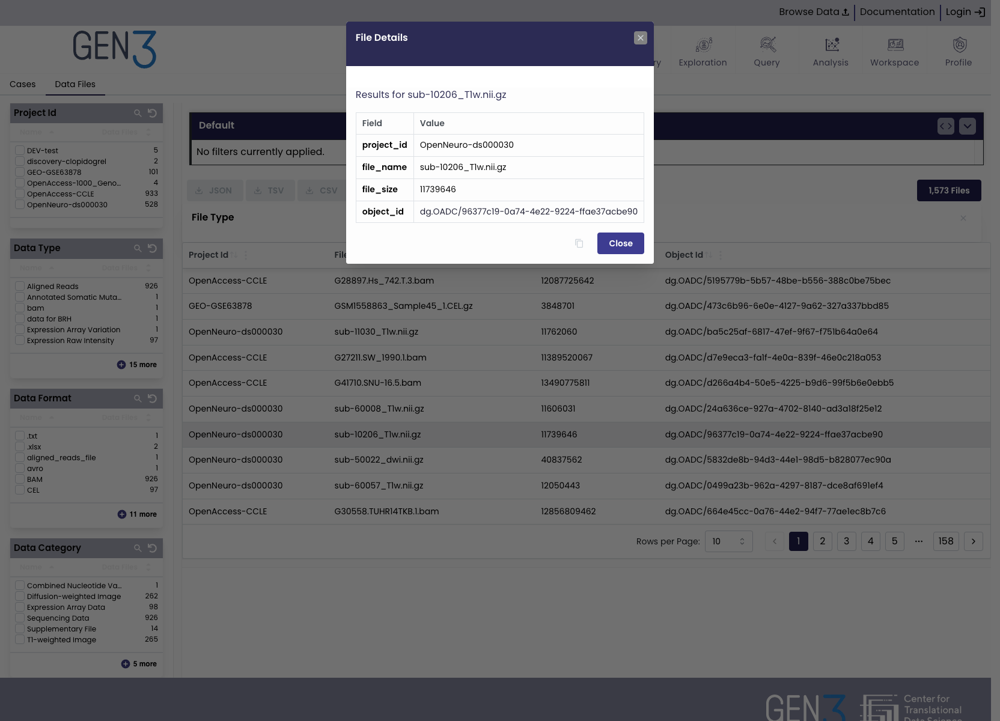

# Configuring Explorer

The Gen3 explorer component is a cohort builder that provides Summary Statistics and  Tables view of filter data. The Cohort builder can have multiple tabs representing each configure index.
For example, "Cases", "Images", "Data Files".

## Configuration

The configuration for the explorer is stored an array of objects. Each object in the array represents a tab in the explorer. The following is an example of a tab configuration:

```json
[
  {
    "enabled": true,
    "title": "Cases",
    "index": "case",
    "table": {
      "enabled": true,
      "pageLimit": {
        "limit": 10000
      },
      "columns": [
        {
          "name": "case_id",
          "label": "Case ID",
          "visible": true,
          "sortable": true
        },
        {
          "name": "project_id",
          "label": "Project ID",
          "visible": true,
          "sortable": true
        },
        {
          "name": "disease_type",
          "label": "Disease Type",
          "visible": true,
          "sortable": true
        }
      ]
    }
  }
]
```


### Download Table Data

Download table is a dropdown of download filetypes. There is support for `csv` `tsv` and `json` formats. Each download has an associated action and is called like:

```json
{
  "dropdowns": {
    "download-menu": {
      "enabled": true,
      "title": "Download Table",
      "leftIcon": "gen3:download",
      "rightIcon": "gen3:chevron-down",
      "dropdownItems": [
        {
          "enabled": true,
          "title": "JSON",
          "leftIcon": "datafile",
          "rightIcon": "download",
          "action": "data-json",
          "actionArgs": {
            "filename": "MIDRC_Series_table.json"
          }
        },
        {
          "enabled": true,
          "title": "CSV",
          "leftIcon": "datafile",
          "rightIcon": "download",
          "action": "data-csv",
          "actionArgs": {
            "filename": "MIDRC_Series_table.csv"
          }
        }
      ]
    }
  }
}
```

The downloads menu is a dropdown with the following members:

* `enabled`(optional default True) - enables the button
* `title` - Label of the button
* `actionTitle` (optional) - label to show when button's action is active
* `leftIcon` (optional) - draw icon on left of the label
* `rightIcon` (optional) - draw icon on right of labe
* `tooltipText` (optional) - tooltip text
* `action` - action function to use for the download
* `actionArgs` - argument for the action
  for example:
  * `filename` - base name of download is used for the actions:
    * `data-tsv`
    * `data-csv`
    * `data-json`


### Download Manifest

Download a file manifest from a explorer table requires the following configuration:json

```json
{
   "enabled": true,
   "type": "manifest",
   "action": "manifest",
   "title": "Download Manifest",
   "leftIcon": "gen3:datafile",
   "rightIcon": "gen3:download",
    "fileName": "manifest.json",
    "actionArgs": {
        "resourceIndexType": "data_file",
        "resourceIdField": "object_id",
         "referenceIdFieldInResourceIndex": "_case_id",
         "referenceIdFieldInDataIndex": "_case_id"
    }
}
```
This is similar to the configuration for Gen3's data-portal except the `actionArgs` member now contains the information that was in the `manifestMapping` member of `gitops.json`

### Details Modal

There is support for a details modal that appears when the table is clicked. The modal's content is rendered using the
default or a registered ```DetailsPanel```.



The basic configuration is:

```json
 "table": {
      "enabled": true,
      "detailsConfig": {
        "panel": "fileDetails",
        "mode": "click",
        "idField": "file_name",
        "title": "File Details",
        "classNames": {
          "header" : "!bg-secondary"
        }
      }

```

The details configuration has the following members:

* mode - mode that activates the modal/drawer. Currently only click is supported
* panel - name of the registered panel, defaults to "default"
* params - object of addition (e.g. custom) parameters/values passed to the Details panel
* classNames: object containing tailwind styling for the modal/drawer component. See [Mantine V6 Modals stules](https://v6.mantine.dev/core/modal/?t=styles-api)
  NOTE: the tailwind directive need to be important so the must be prefixed with ```!```
* title - title of the modal/drawer
* withCloseButton - should modal have a close (i.e. x ) button
* closeOnEscape - if true, closed when the esc key is pressed
* closeOnClickOutside - close when anywhere outside the modal is closed
* size - size of the modal
