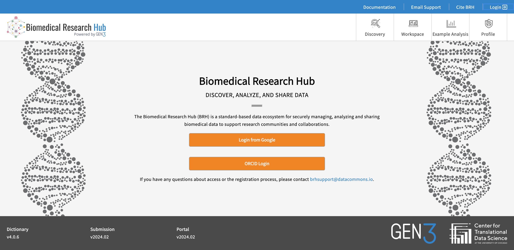
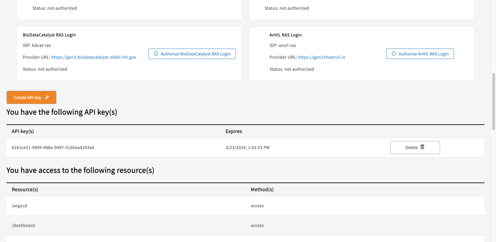
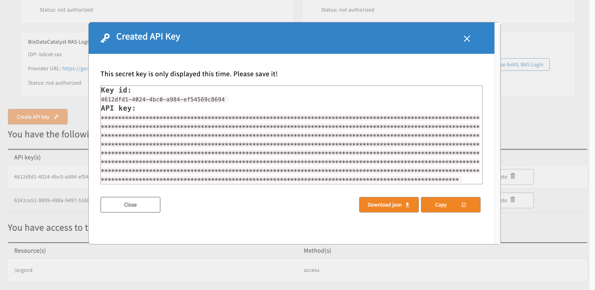
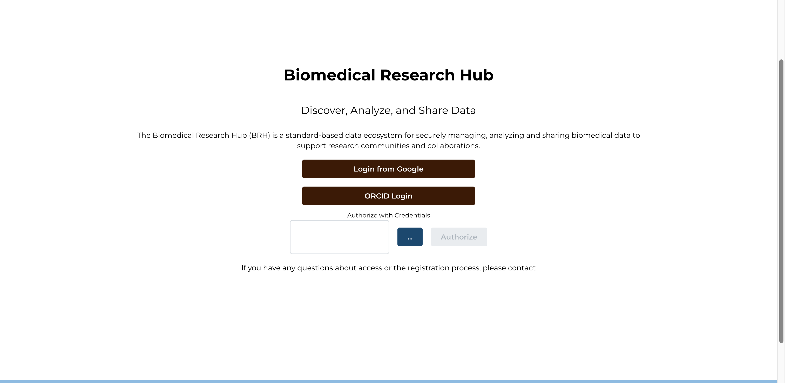
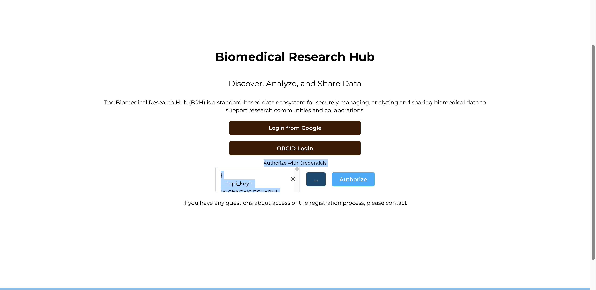
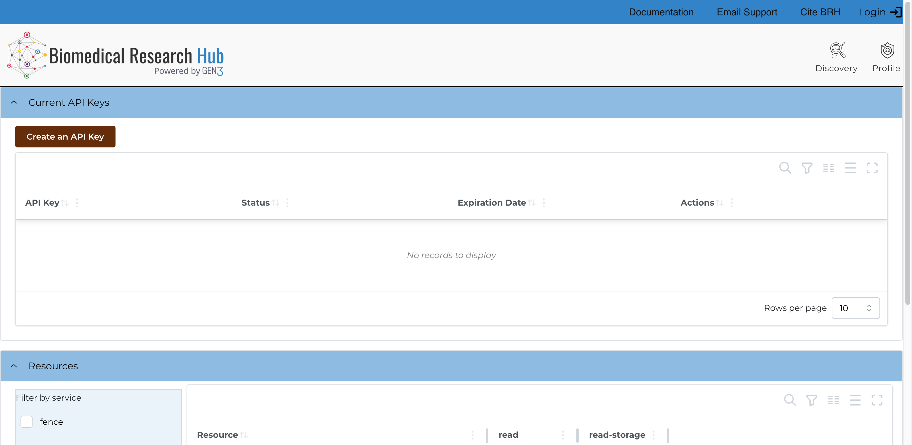

## Using Credentials Login

For development, instead of logging in, you can also use credentials to authenticate. This should work for almost all protected calls except those to create credentials.

You need to activate it in the `login.json` configuration file, by adding `"showCredentialsLogin" : true`:

```json
{
  ...
  "image": "images/gene_side_texture.svg",
  "showCredentialsLogin": true
}

```

To use credentials to log in, you need to first create credentials from a commos: For example,  https://brh.data-commons.org/

1. Log in to Commons:

   

2. Go to profile and scroll down (if needed) to Create API Key:

   

3. Click "Create API Key" and select "Download JSON" in the Modal:

   

Save the credentials file, for this example, let's call it `brh.data-commons.org.json`

2. Run the app: `npm run dev` from the source root

3. Goto: http://localhost:3000/Login



4. Click the [...] button below *Authorize with Credentials*. This will bring up a File Selector dialog. Select the credentials file created above.

   

5. Click the blue Authorize button, and it should succeed.

6. You should be able to go to http://localhost:3000/Profile and see something like:
   

The access token is defined in a cookie, so calls to the WTS endpoint should work. Note that this times out after 20 minutes of inactivity, so you might have to use the credentials to log in again.
