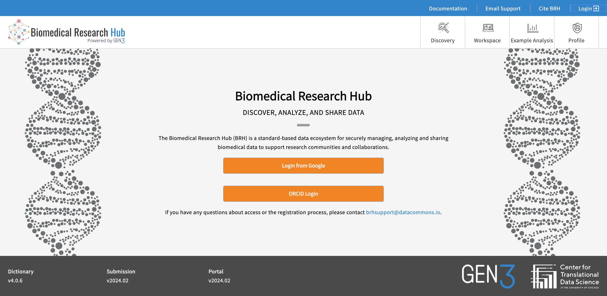

## Using Credentials Login

For development, instead of loggin in you can also use credentials to authenicate. Theis should work for almost all protected call execpt those to create credentials.

To use them, you need to first create credentials from a commos: For example  https://brh.data-commons.org/

1. Login into commons:

   

2. Go to profile and scroll down (if needed) to Create API Key:

   

3. Click create API key and select Download JSON in the Modal:

   

Save the credentials file, for this example let call it `brh.data-commons.org.json`

Next we need to configure the sampleCommons to use BRH's API:

1. edit `packages/sampleCommons/.env.development` so it looks like:

```
GEN3_COMMONS_NAME=brh
NEXT_PUBLIC_GEN3_API=https://brh.data-commons.org
NEXT_PUBLIC_GEN3_DOMAIN=https://localhost:3010
#NEXT_PUBLIC_GEN3_MDS_API=https://brh.data-commons.org/mds
#NEXT_PUBLIC_GEN3_AI_SEARCH_API=http://localhost:8089
#NEXT_PUBLIC_GEN3_GUPPY_API=https://localhost:3010/guppy
```

Note: the branch `feat/creditials_login`  should have this already in the .env file.

2. Run the app: `npm run dev` from the source root

3. Goto: http://localhost:3000/Login


4. Click the [...] button below *Authorize with Credentials* this will bring up a File Selector dialog. Select the credentials file created above.

   

5. Click the blue Authorize button and it should succeed.

6. You should be able to goto http://localhost:3000/Profile and see something like:
   

The access token is defined in a cookie so calls to the WTS endpoint should work. Note that this times out after 20 minutes of inactvity so you might have use the credentials login again.
