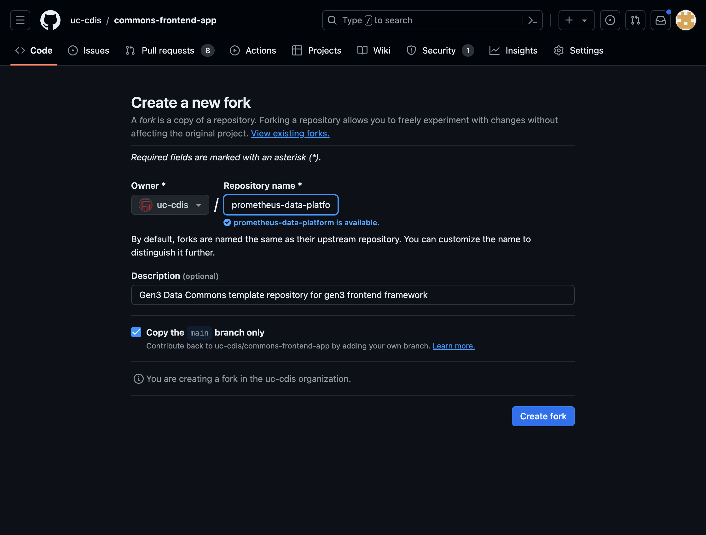

# Setting up a Gen3.2 Data Commons

## Fork the repository:



This will create a new repository with the
contents from ```commons-frontend-app'''
Updates to the commons-frontend-app can them be pulled
into the forked repository. Note that because the
repository being forked is public the fork wil be
public as well. If this is a problem, use
the template instead.

### Repository Settings

Setup the users and groups for the new commons
using the Settings tab in Github.

Setup branch protection, webhooks and any other
requirements.

### Clone the repository

To configure the UI, clone the repository:

```bash
git clone git@github.com:uc-cdis/prometheus-data-platform.git
```
cd into the directory
```bash
cd prometheus-data-platform
```
and run
```bash
npm install
```

This will install all the packages required to run the commons.

## Configuration

The configuration files are located in the ```config``` directory. The configuration directory
contains a number of json files:

* modals.json - configures the System Use Modal
* session.json - configures the login session for the data commons
* themeFonts.json - the fonts for the UI
* themeColors.json - the generated color scheme for the commons
* siteConfig.json - this file is being deprecated
There is also a directory named ```gen3``` which has the configuration for each page of the
commons and the masterColor scheme.

The details of configuring the theme cane be found in the [Styling Guide](../Configuration/Styling and Theming.md)
